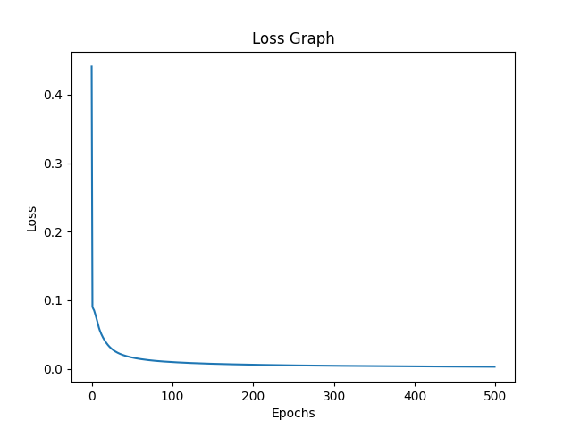
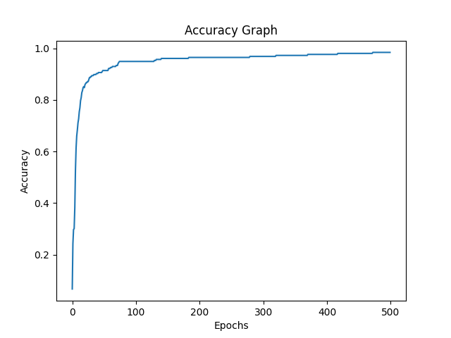

# Model Training Report

## Training

The model was trained using the following parameters:

- Epochs: 500
- Batch size: 256
- Learning rate: 0.01

## Training and Validation Statistics

The final training accuracy was 99.12%, and the final validation accuracy was 97.62%.

The loss decreased steadily over the training process, as shown in the following graph:

The accuracy increased over the training process, as shown in the following graph:

